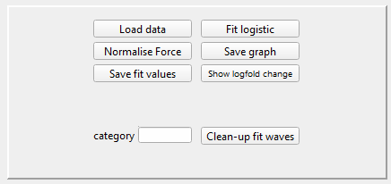

# Usage
Place both .ipf files in your IGOR Pro User Procedure folder and load `FitDroplets.ipf`. This will automatically load `DropletTracker.ipf` and add a $Droplet$ subfolder to the Functions menu.

## Data loading
Select $Droplet$ $Fusion$ $Fitter$ to start the analysis program.



Press load data to select the HDF5 file containing the force trace.
The HDF5 file and corresponding bright-field tiff stack should follow the default Bluelake naming scheme of:
```
    %TIMESTAMP% %CONDITION% Marker %BRIGHTFIELD TIMESTAMP%_Bright-field.h5
    %BRIGHTFIELD TIMESTAMP%_Bright-field.tiff
```
The bright-field image should be located in a subfolder called ~cropped~. This will automatically load the bright-field image corresponding to the selected force trace.

## Fitting the force signal
By default the $A$ and $B$ cursors will be placed at the beginning and end of the loaded trace. If neccessary, move them to set the range of the trace that is used for fitting.


Pressing the $Fit logistic$ button fits the selected range with a function of the form


and normalizes the force trajectory to go from 0 to 1.

## Condensate size determination
In the opened image stack of the brightfield video place the $A$ and $B$ cursors roughly into the center of the two condensates and press the $Generate$ button.
This will determine the condensate sizes using radial profiling. The code uses a nm/px value that is setup specific and needs to bee set in the code beforehand.
If the resulting profile does not fit the condensate well, moving the cursors or changing the `Radius (pxl)` value for the profiling can improve results.


## Processing data

Pressing the $Save$ $graph$ button saves an image of the fit and adds the needed fit and size values to their respective waves.

When all fusion events for one condition are analysed, set the category label in the Fusion Fitting Window and press the `Clean-up fit waves` button.
This will move the fitted velocities an size values to condition specific waves and clear the waves used for temporary storage of the fit values.
For further processing into log10-fold changes the chromatin-only condition should be named either $chromatin$ or $chrom$.

Pressing the `Show logfold change` button will transform the normalized velocities to log10-fold changes relative to the mean velocity of chromatin-only condition and display them in the form of a boxplot.
