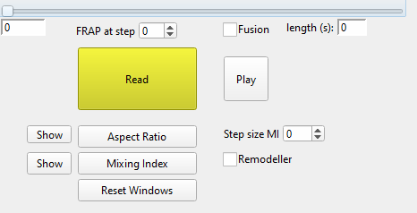

# Usage
Place both .ipf files in your IGOR Pro User Procedure folder and load `particles.ipf`. This will automatically load `Simulation_helper.ipf`.

Type `panel0()` into the command line to open the analysis control window.

## Loading data
Set which type of simulation you want to load using the $Fusion$ checkbox. If unchecked, the program will treat the trajectory as a FRAP file.

Press the $Read$ button to open a file dialog and select the `.traj` file of your simulation.

The program will load the file and show a 3D Gizmo and a 2D scatter representation of the simulated system. It will further print out some information about the simulation into the command line history.

## Analyzing trajectories
Using the slider on top of the control panel or by pressing the $Play$ button allows to go through the different timepoints in the trajectory file.

### Simulated fusion
The $Aspect$ $Ratio$ button calculates the aspect ratio and sphericity at each timestep. Pressing the $Show$ button next to it plots the data. This can be used to analyse the trajectory of simulated fusion experiments. The `GeneralLogistic` function can be used with the IGOR $Curve$ $Fitting$ functionality to fit the data. For a perfectly spherical condensate both aspect ratio and sphericity are 1.

### Simulated FRAP
The $Mixing$ $Index$ button allows the analysis of simulated FRAP experiments.

Set the step size for which to perform the analysis in the $Step$ $size$ $MI$ field, then use the checkbox to select whether remodeller or nucleosome particles should be analyzed.

Mixing is determined by sorting the particles into a left and right half based on their position in the x direction at timestep 0.

Then pairwise distances are calculated between particles in different populations as well as between all particles.
The two resulting distance distributions are then compared using a &chi;² statistic. The result ("Mixing Index") is a measure for how similar the two distributions are, and thus how well they have mixed over time.

Pressing the adjacent $Show$ button produces a plot of the two Mixing Index traces.
